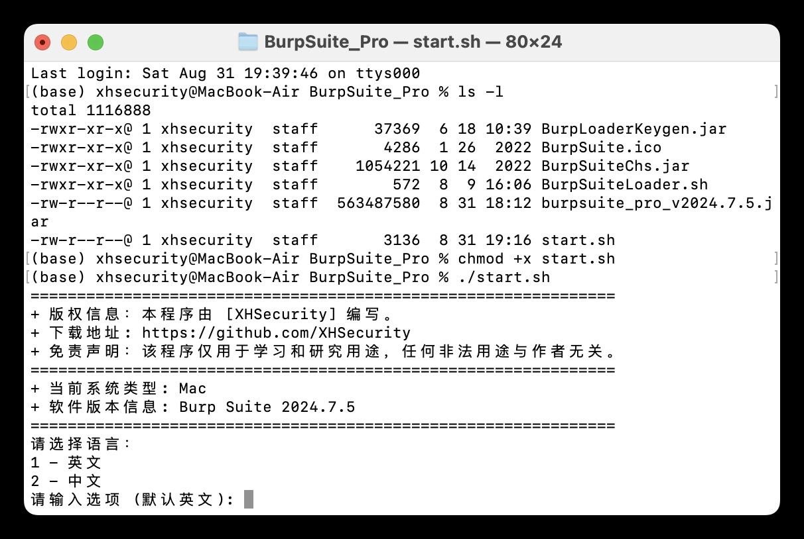
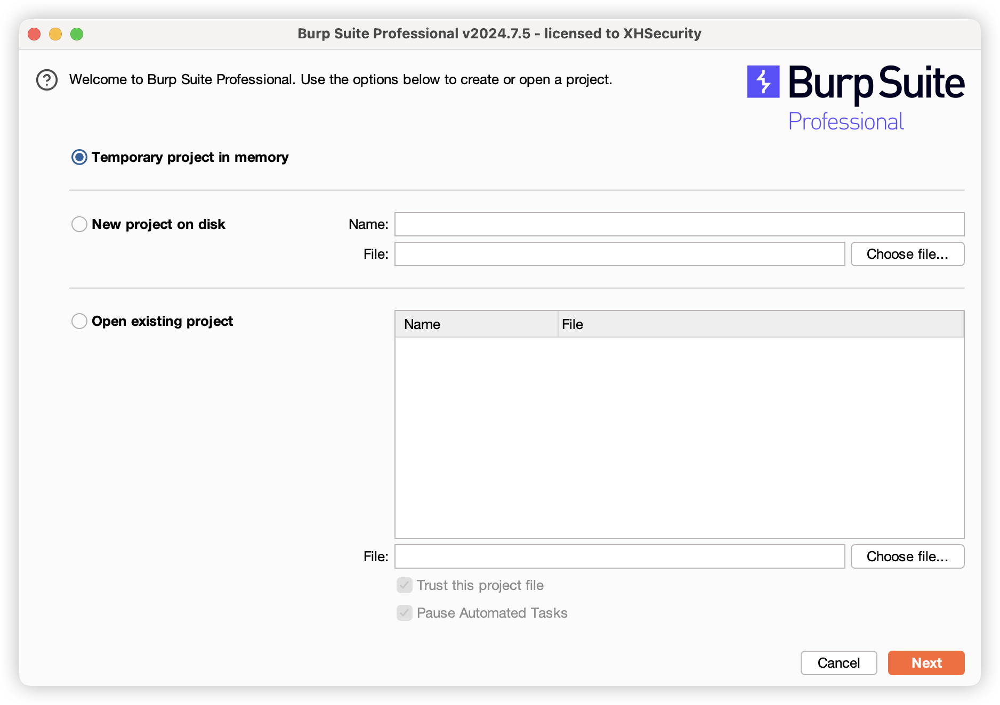
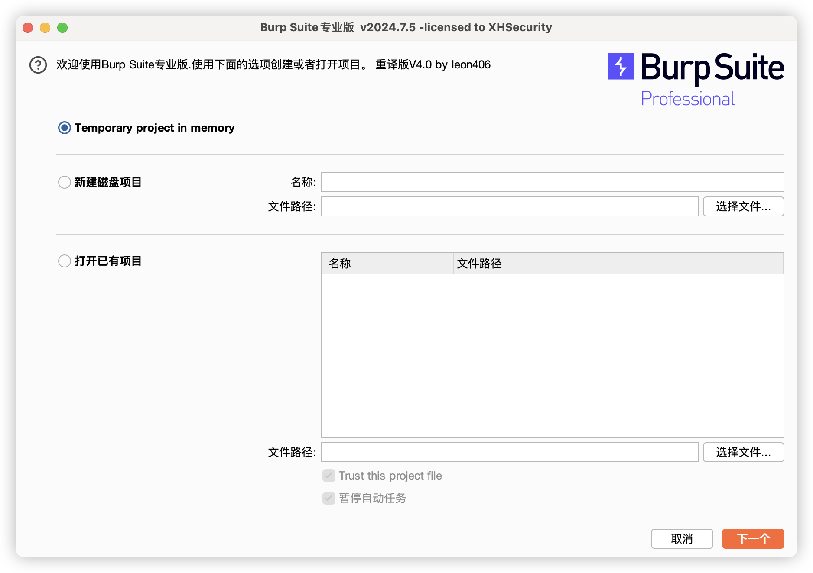

# BurpSuite Pro（Mac特别版）

## 功能
可自由切换中英文版本

## 使用步骤
### 下载burpsuite专业版安装包
https://portswigger.net/burp/documentation/desktop/getting-started/download-and-install

### 拷贝文件
将下载后的burpsuite_pro_v*.jar文件复制到当前文件夹中。

### 修改权限
chmod +x start.sh

### 运行程序
./start.ch

## 运行截图
启动脚本截图

英文版本运行截图

中文版本运行截图

